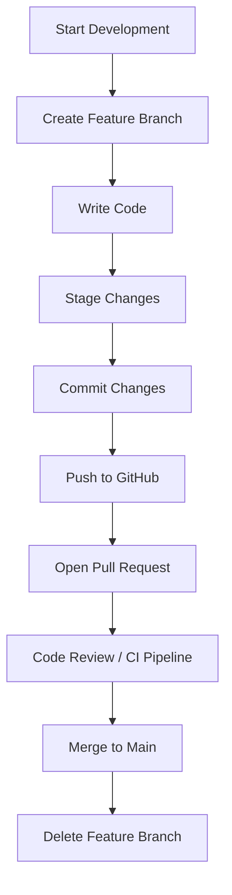

# 🧠 MSSA Cloud App Dev Notes – C#, Docker & .NET Core

*A practical introduction to compiled languages in a modern cloud workflow*

---

### 💡 Why C# Needs a Compiler:

C# is a **compiled language**, which means the code you write (called **source code**) must be **translated into a lower-level language** before the computer can run it. This is done by the **C# compiler**, which turns your `.cs` files into **Intermediate Language (IL)**. The **.NET runtime (CLR)** then translates IL into **machine code** just-in-time (JIT), when your app runs.

> ✅ This makes C# fast, secure, and great for building enterprise-scale cloud applications.

---

### 🐳 Why Use Docker with .NET?

Docker lets you run your C#/.NET app in a **lightweight container** that works the same everywhere — on your dev machine, in Azure, or in production.

Benefits:

* 🚀 **Portability**: "Build once, run anywhere"
* 🔐 **Isolation**: Keeps dependencies clean
* 🧪 **Testability**: Run multiple versions without conflict
* 📆 **CI/CD Ready**: Plug into GitHub Actions, Azure DevOps, etc.

---

### ⚙️ Sample Dockerfile for .NET Core App

```dockerfile
FROM mcr.microsoft.com/dotnet/aspnet:6.0 AS base
WORKDIR /app
EXPOSE 80

FROM mcr.microsoft.com/dotnet/sdk:6.0 AS build
WORKDIR /src
COPY ["MyApp/MyApp.csproj", "MyApp/"]
RUN dotnet restore "MyApp/MyApp.csproj"
COPY . .
WORKDIR "/src/MyApp"
RUN dotnet build "MyApp.csproj" -c Release -o /app/build

FROM build AS publish
RUN dotnet publish "MyApp.csproj" -c Release -o /app/publish

FROM base AS final
WORKDIR /app
COPY --from=publish /app/publish .
ENTRYPOINT ["dotnet", "MyApp.dll"]
```

---

### 🛠 Tools Used

#### 🧱 C# / .NET

[](#)

> Role: Language + Framework

#### 🐳 Docker

[](#)

> Role: Containerized runtime

#### 🧪 VS Code + MSSA

[](#)

> Role: Dev environment

#### 🔙 GitHub + Git

[](#)

> Role: Version control & CI/CD
> \| 🧱 **C# / .NET**   | Language + Framework         |
> \| 🐳 **Docker**      | Containerized runtime        |
> \| 🧪 **VS Code + MSSA** | Dev environment             |
> \| 🔙 **GitHub + Git**| Version control & CI/CD      |
> \| --------------------- | ----------------------- |
> \| 🧱 **C# / .NET**      | Language + Framework    |
> \| 🐳 **Docker**         | Containerized runtime   |
> \| 🧪 **VS Code + MSSA** | Dev environment         |
> \| 🔙 **GitHub + Git**   | Version control & CI/CD |

---

### 📘️ Summary

> You're not just learning C# — you're learning how **modern cloud-native development** works with compiled languages, containers, and collaborative tools like GitHub. This skillset prepares you to work in **real-world cloud dev teams** where your code scales, deploys, and improves automatically.

---

### 📜 Beginner Git Cheat Sheet (for MSSA Devs)

---

### 🗺️ Visual Git Workflow with Mermaid



> 📌 This modern Git workflow helps maintain clean commit history and integrates easily with GitHub Actions CI/CD and PR review pipelines.

---

---

### 🧭 How to Use Git Commands from VS Code GUI

If you prefer to avoid memorizing terminal commands, you can manage Git entirely within Visual Studio Code’s interface:

| CLI Command                     | VS Code GUI Action                                                               |
| ------------------------------- | -------------------------------------------------------------------------------- |
| `git init`                      | Open folder > Source Control panel > Click “Initialize Repository”               |
| `git add .` / `git add <file>`  | Click `+` next to changed files to **stage** them in Source Control panel        |
| `git commit -m "msg"`           | Type your message in the input box > click ✔️ to commit                          |
| `git status`                    | View staged/unstaged/modified files in Source Control panel                      |
| `git log` / `git log --oneline` | Use GitLens or Git Graph to view commit history visually                         |
| `git push`                      | Click the cloud icon (bottom left) or use “Sync Changes” in Source Control panel |
| `git pull`                      | Same cloud icon menu or use `Cmd/Ctrl + Shift + P` > “Git: Pull”                 |
| `git reset --soft HEAD~1`       | Use **GitLens** extension > “Undo Last Commit (Soft)” from its command menu      |

#### 🔧 Recommended VS Code Extensions

* **GitLens** – See commit history, blame, and advanced reset options
* **GitHub Pull Requests and Issues** – View PRs and issues inside VS Code

> 🧠 Bonus Tip: You can even use GitHub Copilot to write commit messages or `.gitignore` files inside VS Code.

---

| 🔧 Action                   | 🧪 Git Command Example                       | 💬 What It Does                                     |
| --------------------------- | -------------------------------------------- | --------------------------------------------------- |
| ✅ Initialize Git            | `git init`                                   | Starts tracking your project with Git locally       |
| 📅 Clone a repo from GitHub | `git clone https://github.com/user/repo.git` | Downloads a copy of a remote GitHub project         |
| ➕ Stage changes             | `git add .` or `git add MyFile.cs`           | Prepares changes to be committed                    |
| 📂 Commit changes           | `git commit -m "Add login feature"`          | Saves a version snapshot with a message             |
| 🚀 Push to GitHub           | `git push origin main`                       | Uploads your local commits to GitHub                |
| 🔄 Pull from GitHub         | `git pull origin main`                       | Gets the latest changes from the remote GitHub repo |
| 🔍 Check status             | `git status`                                 | Shows which files have been changed or staged       |
| 📜 View commit history      | `git log --oneline`                          | Displays a clean list of past commits               |
| ✨ Create a new branch       | `git checkout -b feature/new-ui`             | Starts a new branch for isolated development        |
| ↺ Merge a branch            | `git merge feature/new-ui`                   | Combines a branch into the current one              |

> 👇 Pro Tip: Always commit small and often. It's easier to track and rollback changes if needed.

---

### 🧠 Advanced Git, GitHub Actions & AI Automation – Starter Guide for Aspiring Solutions Architects

#### 🗂 Recommended Folder Structure for Repos

When organizing your project like a Solutions Architect, use a clear and predictable folder structure. This not only helps you and your team understand the codebase, but it also allows AI tools like Copilot to better assist with generating context-aware code and workflows.

**Folder Structure Overview:**

```
/your-project
├── /src        # All your application code
├── /tests      # Unit tests or integration tests
├── /docs       # Markdown documentation and architecture diagrams
├── /workflows  # GitHub Actions YAML files
├── .gitignore
└── README.md
```

**Commands to Create This Structure:**

```bash
mkdir -p your-project/{src,tests,docs,workflows}
touch your-project/{.gitignore,README.md}
```

**Why This Structure Matters:**

* `/src`: Keeps your actual application code clean and centralized
* `/tests`: Encourages testing early and often
* `/docs`: Makes it easy to onboard new team members and track design
* `/workflows`: Keeps CI/CD logic version-controlled and easy to debug

> 📌 AI Prompt Engineering Tip: If your folders follow this naming convention, AI models like Copilot or ChatGPT can more accurately predict and generate automation logic.

---

#### 🧠 Prompt Engineering Example to Auto-Build a GitHub Actions Workflow for .NET

🧪 **Prompt to Copilot or ChatGPT:**

> "Write a GitHub Actions workflow for a .NET 6 app in the `/src` folder. The workflow should trigger on every push to `main`, use Ubuntu, and run `dotnet build` and `dotnet test`."

📋 **AI-Generated YAML Example:**

```yaml
name: .NET CI Pipeline
on:
  push:
    branches: [main]

jobs:
  build-test:
    runs-on: ubuntu-latest
    steps:
      - name: Checkout code
        uses: actions/checkout@v3

      - name: Setup .NET SDK
        uses: actions/setup-dotnet@v3
        with:
          dotnet-version: '6.0.x'

      - name: Restore dependencies
        run: dotnet restore src

      - name: Build the app
        run: dotnet build src --configuration Release --no-restore

      - name: Run tests
        run: dotnet test tests --no-build --verbosity normal
```

> 🧠 Use this prompt pattern to build CI/CD for any tech stack by just swapping out keywords like `dotnet`, `src`, or `main`.

As someone new to software development and architecture, your goal isn’t to memorize every command — it’s to understand the *workflow logic* behind Git, GitHub Actions, and how AI tools like Copilot can make you faster and more strategic.

#### 🚀 Step-by-Step Mindset for Mastery:

1. **Think Like a GitHub Admin, Not Just a Developer**

   * Structure your repos: use folders like `/src`, `/docs`, `/tests`, `/workflows`
   * Set up access roles and permissions early (GitHub Teams or fine-grained PATs)

2. **Automate What You Can (via GitHub Actions)**

   * Use prebuilt actions to test code, build containers, deploy apps
   * Let AI (e.g., Copilot) scaffold workflows, detect programming languages, and create YAML files

3. **Use AI as a Workflow Assistant, Not Just a Code Generator**

   * Prompt Copilot with questions like:

     * “Write a GitHub Actions workflow for a C# .NET build with Docker”
     * “Suggest a `.gitignore` for a .NET and Python mixed repo”

4. **Practice Git Like a Pro**

   * Reset safely (`git reset --soft HEAD~1` for staging)
   * Amend mistakes (`git commit --amend`)
   * Rebase cleanly before merging (`git rebase -i`)

5. **Watch and Learn via Logs**

   * Use `Actions > Run` tab in GitHub to trace workflow failures
   * Use `git log`, `git diff`, and `git blame` to diagnose commits

#### 🛠 Real-World GitHub Actions Use Case

#### 🔧 How to Use GitHub Copilot to Generate CI/CD Workflows

1. **Open a `.yml` or `.yaml` file in the `/workflows` folder of your repo**
2. **Type a comment at the top describing what you want**
3. **Copilot will auto-suggest the full YAML block below your comment**
4. **Review the logic, adjust values (e.g., branch name, directory), and save**

---

🧪 **Copilot Prompt for Ubuntu CI/CD (.NET):**

> "Create a GitHub Actions workflow using `ubuntu-latest` that builds and tests a .NET 6 app in the `/src` folder. Trigger it on push to the `main` branch."

🧪 **Copilot Prompt for Windows CI/CD (.NET):**

> "Create a GitHub Actions YAML file that runs on `windows-latest`, builds a .NET 6 solution in `/src`, and runs unit tests from the `/tests` folder. Trigger the workflow on every push to `main`."

---

🧪 **Prompt to Copilot or ChatGPT:**

> "Generate a GitHub Actions workflow for a .NET 6 application located in the `/src` directory. The workflow should trigger on every push to the `main` branch. It should include steps to checkout the code, set up the .NET SDK, build the application in Release mode, and publish it to an `out` directory. Use `ubuntu-latest` as the runner."

📋 **YAML Output from Prompt:**

```yaml
name: Build and Push .NET App
on:
  push:
    branches: [main]

jobs:
  build:
    runs-on: ubuntu-latest
    steps:
      - name: Checkout repo
        uses: actions/checkout@v3

      - name: Set up .NET SDK
        uses: actions/setup-dotnet@v3
        with:
          dotnet-version: '6.0.x'

      - name: Build
        run: dotnet build --configuration Release

      - name: Publish
        run: dotnet publish -c Release -o out
```

> 🧠 AI Tip: Copilot can write this YAML file for you if you ask clearly — describe your language, build step, and trigger conditions.

---

### 🧩 Can You Run Git Reset from GitHub Web UI?

While GitHub’s front end is user-friendly, it doesn’t support all command-line features like `git reset --soft` directly. However, here’s what you *can* and *can’t* do:

#### ✅ GitHub Web Features That Overlap with Git CLI

| Feature                       | What It Does                              | CLI Equivalent         |
| ----------------------------- | ----------------------------------------- | ---------------------- |
| ✅ Revert a commit             | Undoes a commit with a new one            | `git revert`           |
| 🗑️ Delete a file via UI      | Opens a PR to remove a file               | `git rm`, `git commit` |
| 🔄 Rebase/squash via PR       | Allows rewriting history before merge     | `git rebase -i`        |
| ✍️ Edit commit messages in PR | Adjust messages when squashing or merging | `git commit --amend`   |

#### ❌ Limitations in the GitHub Web UI

* `git reset --soft`, `--mixed`, or `--hard` not supported
* No ability to rewire `HEAD` or move branch pointers
* Cannot selectively stage changes from UI like with `git add -p`

#### ✅ Alternatives for Non-Terminal Users

| Tool              | Benefit                                                 |
| ----------------- | ------------------------------------------------------- |
| GitHub Desktop    | Visual history, undo, discard changes                   |
| GitKraken         | GUI-based Git with partial reset & rebase functionality |
| VS Code + GitLens | Interactive staging, commit viewer, timeline controls   |

> 💡 Pro Tip: If you need the behavior of `git reset --soft` in a visual way, GitHub Desktop or GitLens inside VS Code are your best bet.

---

### 🔄 GitHub Enterprise Multi-Repo Migration Steps

If you're migrating several GitHub repositories to GitHub Enterprise, here’s a clear overview of the process:

#### ✅ Step-by-Step Migration Workflow

| Step | Action                                                                                                        |
| ---- | ------------------------------------------------------------------------------------------------------------- |
| 1️⃣  | **Pre-Migration Audit**: List all repos, teams, permissions, secrets, CI/CD integrations.                     |
| 2️⃣  | **Set up the destination org** in GitHub Enterprise (Cloud or Server).                                        |
| 3️⃣  | **Create personal access tokens** with admin rights on source and target.                                     |
| 4️⃣  | Clone all repos with full history using mirror: <br> `git clone --mirror https://github.com/old-org/repo.git` |
| 5️⃣  | Push each mirror to the new org: <br> `git push --mirror https://github.com/new-org/repo.git`                 |
| 6️⃣  | Rebuild repo settings (branches, webhooks, deploy keys, Actions secrets).                                     |
| 7️⃣  | Recreate team structures using the **GitHub REST API or CLI scripting**.                                      |
| 8️⃣  | Test everything — Actions pipelines, integrations, SSO logins.                                                |
| 9️⃣  | **Lock old repos** (read-only) and notify users.                                                              |
| 🔟   | Monitor logs and access patterns post-migration.                                                              |

#### 🛠️ Recommended Tools

* GitHub CLI (`gh`) for repo creation and permissions
* REST or GraphQL API for automation
* Bash or PowerShell scripting for bulk operations
* GitHub Enterprise Importer or `ghe-migrator` (for GHES)

Great question — here’s how **test, QA, dev, and production environments** are typically structured and managed within **GitHub**, especially for GitHub Actions and repo-based workflows.

---

## 🧭 How GitHub Handles Environments

GitHub has **native support** for environments such as:

* **Development**
* **QA / Staging**
* **Production**

Each one can:

* 🔐 Require **manual approvals**
* 🧪 Use **environment-specific secrets** (API keys, tokens)
* 🛑 Enforce **deployment protection rules**
* ⏱ Track **deployment history**

---

## ✅ Setting Up Environments in GitHub

Here’s how a **GitHub Admin** sets up environments step by step:

### 1. **Go to the Repo → Settings → Environments**

* Click **“New environment”**
* Name it: `development`, `qa`, `production`, etc.
* Optionally add:

  * **Required reviewers**
  * **Wait timer** (e.g. 30 minutes before deploy)
  * **Secrets** (like `PROD_DB_TOKEN`, `QA_API_KEY`)

### 2. **Reference Environments in GitHub Actions YAML**

You define which environment a workflow job targets using `environment:`:

```yaml
jobs:
  deploy:
    runs-on: ubuntu-latest
    environment:
      name: production
      url: https://myapp.com
    steps:
      - name: Checkout
        uses: actions/checkout@v3

      - name: Deploy app
        run: ./deploy.sh
```

---

## 🔐 Secrets Per Environment

Secrets like `PROD_DB_KEY` or `QA_SERVER_TOKEN` can be scoped:

* **Repo-level** → visible to all workflows
* **Environment-level** → only available when `environment:` matches

To add:

1. Go to the environment in GitHub Settings
2. Click **“Add Secret”**
3. Name it and paste your key

---

## 🧪 Workflow Branch Targeting Strategy

| Environment       | Branch              | Purpose                  |
| ----------------- | ------------------- | ------------------------ |
| `development`     | `dev`               | Feature testing          |
| `qa` or `staging` | `staging`           | UAT & regression         |
| `production`      | `main` or `release` | Final production release |

You trigger based on branch:

```yaml
on:
  push:
    branches:
      - main     # production
      - staging  # QA
      - dev      # development
```

---

## 📈 Visual Summary (Optional Mermaid Flow)

```mermaid
flowchart LR
    DevBranch[Dev Branch] -->|Push| DevEnv[Development Environment]
    DevBranch -->|Merge| StagingBranch[Staging Branch]
    StagingBranch -->|Push| QAEnv[QA/Staging Environment]
    StagingBranch -->|Merge| MainBranch[Main Branch]
    MainBranch -->|Push| ProdEnv[Production Environment]

> ✅ This line was added to test a pull request.

